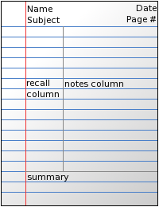

[Obsidian](https://obsidian.md) is a Markdown-based note taking tool focused on connections between notes. Today, I'll show you how I transcribe my handwritten [Cornell notes](https://en.wikipedia.org/wiki/Cornell_Notes) into a linkable web of thought.

*Related: [Why You Should Take Notes By Hand](https://www.psychologytoday.com/us/blog/creative-leadership/201902/why-you-should-take-notes-hand)*

*Image courtesy of Icez~enwikibooks at English Wikibooks, Public domain, via Wikimedia Commons*

I first begin by creating a scratch note, similar to a [map of content](https://publish.obsidian.md/hub/05+-+Concepts/Maps+of+Content+(MOC)) (MOC). It's temporary, but it can be evolved into a MOC if you want, or just deleted when done. 

I read down the recall column (the left column on the side of the Cornell notes), determining if each item is worthy of its own note, if it will be in another note, or left out entirely (which probably defeats the point of having it written in your original handwritten notes in the first place, but I won't judge).

If it does end up being worthy of its own note, add a link to a bulleted list in said scratch note to come back to later.

After you've finished with that, click on the links and start transcribing your notes. Make sure to add links when you come across things you have notes on or might take notes on in the future.

Repeat this until you're done. After that, enjoy your new digitized notes!

*Originally posted by me on [my old Write.as blog](https://tomodachi.writeas.com).*
